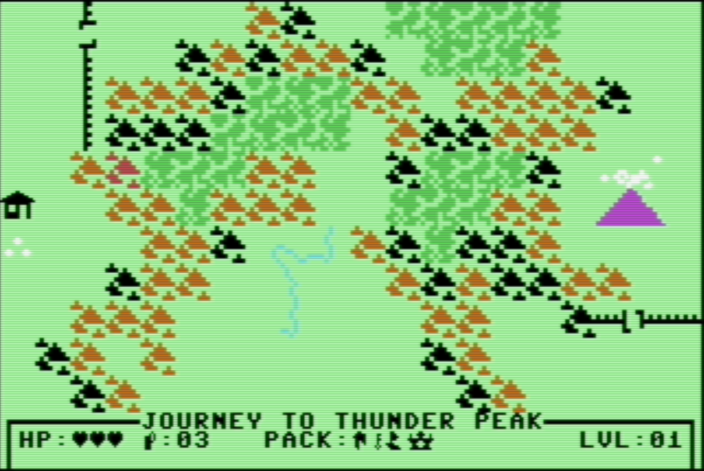

# JOURNEY TO THUNDER PEAK

[](https://en.wikipedia.org/wiki/Commodore_64)
[](https://github.com/ichigyo/oscar64)
[](LICENSE)

> *The earth trembles, the entrance looms. Will you survive the depths?*

**Journey to Thunder Peak** is an 8-bit RPG odyssey for the Commodore 64. Descend into the shadow of a legendary dungeon in this C-powered retro adventure. Ancient secrets lie buried beneath the stone, and only those with the resolve to enter the deep will uncover what the Peak has guarded for centuries.

---

## ⚔️ The Adventure
* **Classic Dungeon Crawling** – Traverse a jagged, subterranean world built with authentic 8-bit aesthetics.
* **Atmospheric Mystery** – A journey focused on the echoes and dangers of the deep.
* **Handcrafted Visuals** – Custom-designed PETSCII environments and sprites.

## 🛠️ Current Progress
The Commodore 64 was my "dream" computer in my childhood, but I never had one (seems like everyone else did though ;-)
So, I'm excited to "live my dream" through the Commodore 64 Ultimate, and what better adventure to take than programming
some retro-style games that I enjoyed in the 1980's. I am a professional software developer, but this is my first foray
on the Commodore 64, so this is very much a learning project. 

The engine is currently in the early prototype phase. Recent milestones include:
* **Hybrid Charset System**: Integration of custom charset with standard ROM typography.
* **Dynamic HUD**: Real-time rendering of player stats and inventory status.
* **Map and Tile System**: A dynamically generated overworld map using tilesets.
* **Joystick Movement**: Joystick enabled movement - left, right, up, down, plus diagonals!
* **Idle Events**: This is an Adventure, and things can happen at anytime.


---

## ⚙️ Project Build
While the heart of the game is adventure, the engine is built for reliability:
* Built with the **Oscar64** C toolchain for the MOS 6510.
* Modular game logic for a smooth, deep-crawl experience.
* Designed for original hardware and VICE emulation.

## 🚀 Getting Started

### Prerequisites
* **Oscar64 Compiler** – The core C toolchain for the MOS 6510.
* **VICE Emulator** – The primary environment for testing and debugging.
* **VSCode & VS64 Extension** – The recommended IDE setup for integrated building and symbol mapping.
* **Ninja Build** – High-speed build system used for compiling the project.

### Building & Running
The project is optimized for a **Ninja**-based workflow within VSCode:

1. **Open Project** – Open the project folder in VSCode.
2. **VS64 Setup** – Ensure the VS64 extension is configured with your Oscar64 installation path.
3. **Build** – Press `Ctrl+Shift+B`. The extension will invoke Ninja to compile the source and link the game.
4. **Run** – The generated `JTTP.PRG` can be set to auto-launch directly into the VICE emulator for immediate testing.

### Manual Build (Alternative)
If you prefer building from the terminal:
```bash
cmake -G Ninja -B build
ninja -C build
```
### Debugging
This project generates a `.dbj` debug symbol file. Use the VICE monitor (`Alt+H`) with `-moncommands` to see C labels in the assembly.

## 📜 License
This project is MIT licensed - see the [LICENSE](LICENSE) file for details. Use it, break it, fix it, or build on it! All I ask is a tiny nod in your README or credits—think of it as "Loot Sharing" for the open-source community.
